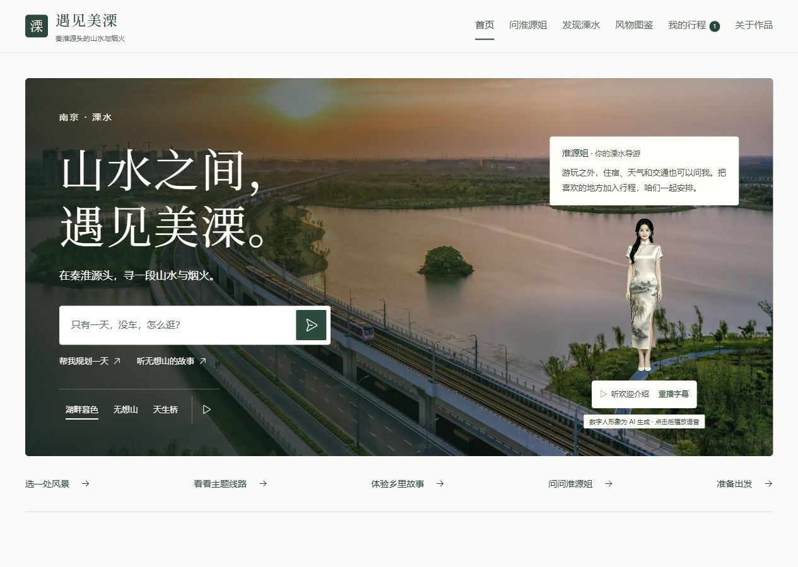

# 全站新版 UI · 源站发布记录

用户已批准将新版样板改为正式代码并发布。2026-10-07 发布至 `lsguide.cn` 源站，版本 `20261007-whole-ui-9e04784d41`。本轮仅替换前端静态文件；既有问答、已审资料、服务接口与浏览器行程数据继续使用。

## 页面改动

首页采用实景大图、松绿色与留白、文旅标题和简洁的提问入口；发现、详情、图鉴、对话、行程、出行服务、文化体验与关于页统一字号、间距、控件和照片比例。行程的可选主题、对话的恢复提示支持展开，手机对话输入区位于底部导航上方。生产版不显示开发对比工具；开发环境仍可使用 `/design-preview` 比较。

参考方向来自用户提供的乌镇与 Awwwards。两站当时实时访问存在超时/证书限制，参考了可访问的检索资料和案例缩略图；未绕过证书警告，也未声称完整浏览两站。本批继续使用项目原有实景素材。

## 验证与保护

- 本地全部 145 项回归通过，`audit:guide` 与生产构建通过；29 个风物、8 类服务、127 条已审知识及向量索引保持原状态。
- 服务器 Nginx 私有回环入口逐文件核对 87 个发布文件的 SHA256，9 条页面路由均返回 200。正式首页显示新版样式，开发对比工具为 0，未出现横向溢出。
- 实际浏览器验证：原有行程可读取；独立测试来源加入/移除天生桥、生成 750×1500 PNG 行程卡、已审问答与图鉴搜索正常。测试新增行程已移除，未操作原有行程。
- 发布前后问答、真实 SSE、住宿条件缺失提示、天气、地点、翻译通过；不可信 Origin 返回 403、无效角色返回 400。
- 发布后公共车站地点查询与驾车路线返回 200；2026-10-09 至 10-10、每晚预算 500 元的溧水住宿搜索返回 200、5 条酒店结果。仅执行搜索，未创建订单。结果不代表未来可订性或价格承诺。
- cyberemotionlab.cn 的静态/应用构建文件合计 536 个、14 份 Nginx 配置及本站 9 个 API/env/unit 文件哈希不变；cyber 应用和本站 API 进程不变。未重载 Nginx、未重启 API、未改动 TLS/Cloudflare。
- 保留原有 Cloudflare 源站访问限制、API 回环绑定、限流、请求大小限制和安全响应头。公开构建扫描本机配置的密钥值，匹配数为 0；敏感路径没有暴露实际文件。
- 桌面和约 389px 宽度检查见前期[样板记录](whole-site-ui-2026-10-07.md)。这些验证不等同于新游客试用或真实手机键盘/普通浏览器实际下载验收。

按用户要求不处理 525。结论为“源站新版已发布并通过核验”，不宣称公网 Cloudflare 问题已恢复。[结构化核验记录](whole-ui-deployment-2026-10-07.json)保留发布前后结果。

## 备份与回退

- 前端构建与 107 个前端源码/配置快照：`/home/zhangpanhh/apps/lishui-web/static-releases/20261007-whole-ui-9e04784d41`，位于私有目录，不置于网站公开根目录。
- 发布目标：`/var/www/lsguide`。资源先发布，HTML 最后原子替换；旧哈希资源保留，兼容尚未刷新的浏览器页面。
- 原站备份：`/var/backups/lishui-guide/20261007-whole-ui-9e04784d41`。
- 发布包 SHA256：`c86a760f2f1dc60abc30cd11681da0b161043d2c14469bef5b1e9ec4a7b8627a`。

需要撤回本次前端时，服务器运行：

```sh
sudo python3 /var/backups/lishui-guide/20261007-whole-ui-9e04784d41/rollback.py
```

回退只恢复目标网站原静态文件；不会更改 API、Nginx 配置或其他站点。SSH 使用现有密钥与已知主机指纹校验，未开启密码 SSH；sudo 凭据只经隐藏输入保存在会话内存，操作结束已关闭会话。


